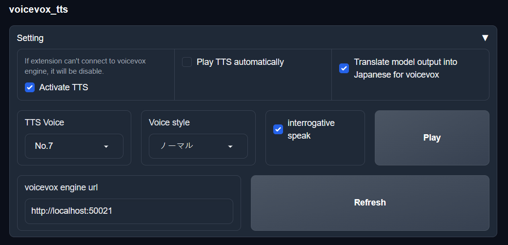

# voicevox-tts

---
voicevox tts for [oobabooga/text-generation-webui](https://github.com/oobabooga/text-generation-webui).

# Install

---
1. Create conda environment following by [text-generation-webui#manual-installation-using-conda](https://github.com/oobabooga/text-generation-webui#manual-installation-using-conda)
2. Clone this repository and `cd` into repository folder.
```commandline
git clone https://github.com/asadfgglie/voicevox-tts.git
cd voicevox-tts
```
3. Activate `textgen` environment make from [text-generation-webui#manual-installation-using-conda](https://github.com/oobabooga/text-generation-webui#manual-installation-using-conda), and use pip install dependency
```commandline
conda activate textgen
pip install -r requirements.txt
```
4. Install voicevox engine following by [VOICEVOX/voicevox_engine](https://github.com/VOICEVOX/voicevox_engine#%E3%83%80%E3%82%A6%E3%83%B3%E3%83%AD%E3%83%BC%E3%83%89)
5. Start text-generation-webui and go to `Session` > `Install or update an extension`, and put https://github.com/asadfgglie/voicevox-tts in it.
6. Press `ENTER` to install

# How to use

---
1. Before enable this extension, you must start `voicevox_engine`, make sure it is running on default port `50021`.
2. Enable this extension
3. Select Speaker, style
4. Chat with bot!

# Feature

---


* You can test voice by click `Play` button.
* You can change your voicevox engine server by click `Refresh` button.
* You can change speaker by change `TTS voice`.